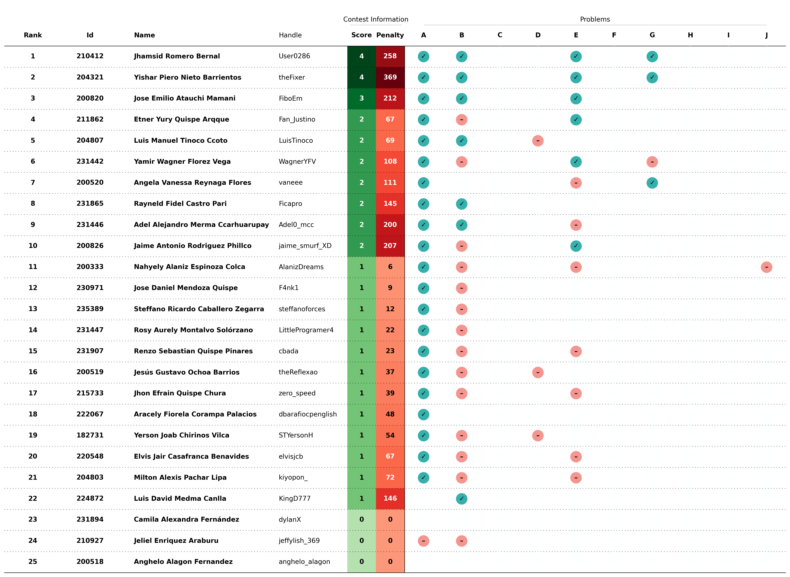
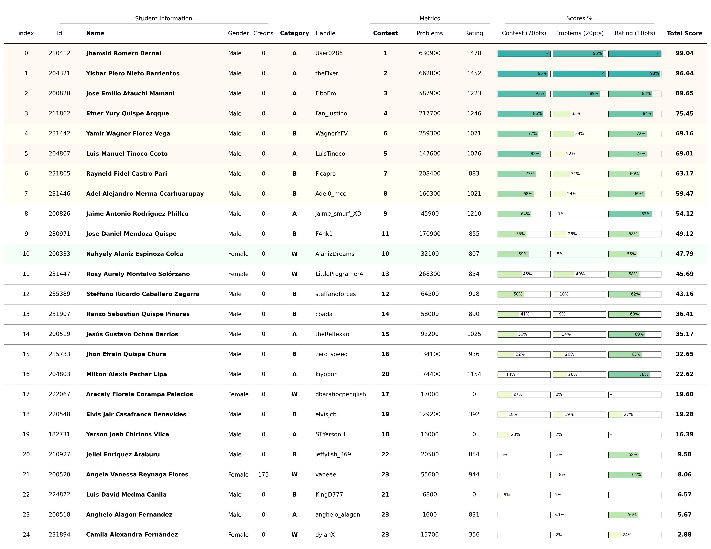

# Training Camp Argentina 2024

This is a student selection process for the [Training Camp Argentina 2024](https://www.pc-arg.com/tc-arg/more_info) that will take place at the `Universidad Nacional de Rosario` in the city of `Rosario, Provincia de Santa Fe` from `July 08 to 19`.

## Registration

Students registered for the selection process through the following:

- **Google Forms**: [REGISTRO PARA EL TRAINIG CAMP ARGENTINA 2024](https://docs.google.com/forms/d/1DBvFgVbH2CUVbbrm9XBCr9KXbFA4eMBG2294ybBhEmk/edit#responses)

For more details about the registered students, see the [registration file](registered.csv).

## Contest

Selection contest was done using the [Virtual Judge](https://vjudge.net/) platform. This contest involves **basic algorithmic concepts** necessary as a minimum requirement to attend the `Argentina Training Camp 2024`. More details of the contest below:

- **Contest**: [Training Camp Selection 2024 - UNSAAC](https://vjudge.net/contest/627547)
- **Password**: `cpunsaac10`
- **Participants**: `25`
- **Problems**: `10`
  - **A - Two Computers**: `Implementation` ([editorial](https://github.com/lightoj-dev/problem-tutorials/blob/main/1001/en.md))
  - **B - My Nose Grows Now**: `Implementation` ([editorial](https://github.com/lightoj-dev/problem-tutorials/blob/main/1241/en.md))
  - **C - War Of The Ring**: `Data Structure`
  - **D - Largest Rectangle**: `Data Structure`([editorial](https://github.com/lightoj-dev/problem-tutorials/blob/main/1083/en.md))
  - **E - Count Points In Segments**: `Binary Search` ([editorial](https://github.com/lightoj-dev/problem-tutorials/blob/main/1088/en.md))
  - **F - Minimum Steps**: `Dynamic Programming`
  - **G - Blossom, Bubbles, and Buttercup**: `Breadth First Search` ([editorial](https://github.com/lightoj-dev/problem-tutorials/blob/main/1238/en.md))
  - **H - Reconstruction**: `Minimum Spanning Tree` ([editorial](https://github.com/lightoj-dev/problem-tutorials/blob/main/1041/en.md))
  - **I - Great Magical Lamp**: `Segment Tree`
  - **J - DNA**: `Suffix Tree` ([editorial](https://github.com/lightoj-dev/problem-tutorials/blob/main/1224/en.md))

## Scoreboard

The complete final scoreboard of the contest can be consulted at [scoreboard document](../../../scoreboard/selection/training-camp-argentina-2024/scoreboard.csv) or [scoreboard image](../../../scoreboard/selection/training-camp-argentina-2024/scoreboard.png).

## Ranking

The complete ranking information generated by the script for the selection of students can be found in the [ranking document](ranking.csv) or [ranking image](ranking.png).

## Selection

The final list of students selected by category is summarized in the following table:

| Rank | Id | Name | Attend |
| - | - | - | - |
| 1 | 210412 | Jhamsid Romero Bernal | Yes/No? |
| 2 | 204321 | Yishar Piero Nieto Barrientos | Yes/No? |
| 3 | 200820 | Jose Emilio Atauchi Mamani | Yes/No? |
| 4 | 211862 | Etner Yury Quispe Arqque | Yes/No? |
| 6 | 204807 | Luis Manuel Tinoco Ccoto | Yes/No? |

| Rank | Id | Name | Attend |
| - | - | - | - |
| 5 | 231442 | Yamir Wagner Florez Vega | Yes/No? |
| 7 | 231865 | Rayneld Fidel Castro Pari | Yes/No? |
| 8 | 231446 | Adel Alejandro Merma Ccarhuarupay | Yes/No?|

| Rank | Id | Name | Attend |
| - | - | - | - |
| 10 | 200333 | Nahyely Alaniz Espinoza | Yes/No? |

## Next steps
- Register for the Training Camp Argentina 2024 through the [Google Forms](https://docs.google.com/forms/d/e/1FAIpQLSdLZTFTqlv4tptvv-tZQtWJkfWPlHRk6thsUQUUmtC8Hm4lDw/viewform)
  - Confirm assistance
  - Request invitation letter

- Contact the organizers to provide some personal information
