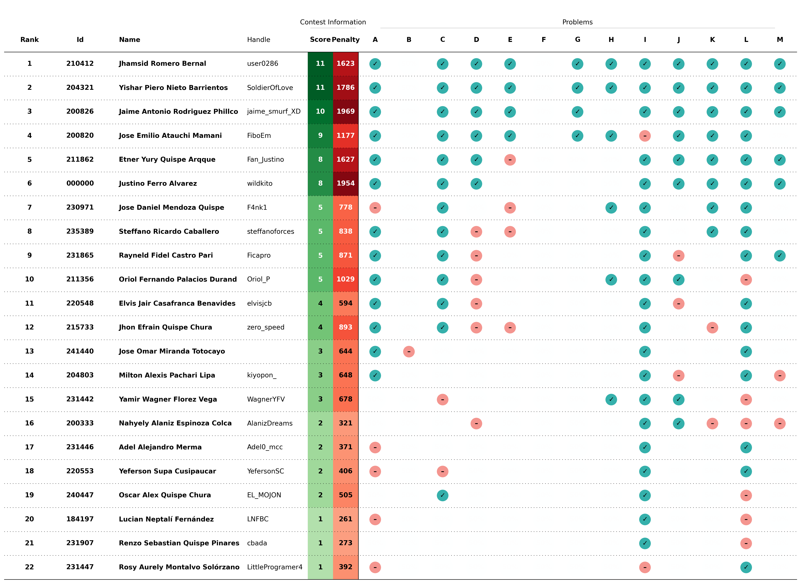
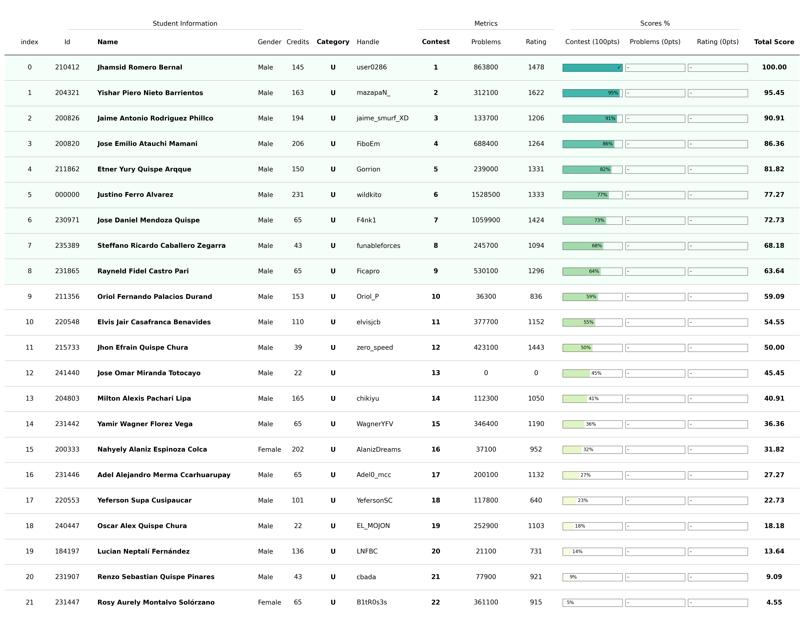

# Selectiva ICPC e IEEExtreme 2024

Este es un proceso interno de selección de estudiantes para el [The 2024 ICPC South America/South Finals](https://icpc.global/regionals/finder/SouthAmerica-South) y el [IEEEXtreme 18.0](https://ieeextreme.org/) que se llevará a cabo el `09 de Noviembre` y el `26 de Octubre`.

## Registro

Los estudiantes se registraron para el proceso de selección a través del siguiente:

- **Google Forms**: [Selectiva ICPC e IEEExtreme 2024](https://docs.google.com/forms/d/1o1al2BORNXih3TMalpBYR0G1Js1k9e4uzKx4ivVKXL0/edit?ts=66e8aa6d#responses)
  - Nombre completo
  - Fecha de nacimiento
  - Código de Universidad
  - Correo electrónico
  - Total de créditos acumulados
  - Lenguage de Programación
  - Usuario de VJudge
  - Usuario de Codeforces
  

Para más detalles sobre los estudiantes registrados, consulte el [archivo de registro](registered.csv).

## Concurso

El concurso de selección se realizó utilizando la plataforma [Virtual Judge](https://vjudge.net/). Este concurso involucra **conceptos algorítmicos básicos** necesarios como requisito mínimo para asistir al `ICPC 2024` y `IEEExtreme 2024`. Más detalles del concurso a continuación:

- **Concurso**: [2024 - UNSAAC Selectiva ICPC](https://vjudge.net/contest/658734)
- **Contraseña**: `selectivaicpc2024`
- **Duración**: `5 horas`
- **Participantes**: `22`
- **Problemas**: `13`
  - **[A - Max Min](https://atcoder.jp/contests/abc262/tasks/abc262_c)**
  - **[B - WozMit Hates Sigma Problems](https://atcoder.jp/contests/abc371/tasks/abc371_e)**
  - **[C - AtCoder Big Contest](https://atcoder.jp/contests/abc285/tasks/abc285_c)**
  - **[D - K Swaps](https://atcoder.jp/contests/abc254/tasks/abc254_c)**
  - **[E - Kleiber's Summer Street Parade](https://www.spoj.com/problems/STPAR/en/)**
  - **[F - Segment GCD](https://codeforces.com/problemset/problem/914/D)**
  - **[G - Chemistry Test](https://codeforces.com/problemset/problem/445/B)**
  - **[H - This is CFT not FFT](https://codeforces.com/problemset/problem/1152/B)**
  - **[I - Lazy Student](https://codeforces.com/problemset/problem/369/A)**
  - **[J - Transform String](https://atcoder.jp/contests/abc259/tasks/abc259_c)**
  - **[K - Twidai Network](https://atcoder.jp/contests/abc278/tasks/abc278_c)**
  - **[L - Famous Drink](https://codeforces.com/problemset/problem/706/B)**
  - **[M - Change Usernames](https://atcoder.jp/contests/abc285/tasks/abc285_d)**

## Scoreboard

El scoreboard final completo del concurso se puede consultar en el [documento](../../scoreboard/selectiva-icpc-2024/scoreboard.csv) o en la [imagen](../../scoreboard/selectiva-icpc-2024/scoreboard.png).

## Ranking

La información completa del ranking generada por el script para la selección de estudiantes se puede encontrar en el [documento](ranking.csv) o en la [imagen](ranking.png).

## Selección (Resultados preliminares para revisar)

La lista final de estudiantes seleccionados para el **ICPC 2024** se resume en la siguiente tabla:

| Ranking | Código | Nombre | Creditos| Fecha de Nacimiento | Contacto | Asistencia |
| - | - | - | - | - | - | - |
| 1 | 210412 | Jhamsid Romero Bernal | 145 | 05/11/2003 | +0 | No |
| 2 | 204321 | Yishar Piero Nieto Barrientos | 163 | 09/09/2002| +0 | No |
| 3 | 200826 | Jaime Antonio Rodriguez Phillco | 194 | 24/03/2003| +0 | No |
| 4 | 200820 | Jose Emilio Atauchi Mamani | 206 | 26/06/2024 | +0 | No |
| 5 | 211862 | Etner Yury Quispe Arqque | 150 | 27/02/2013 | +0 | No |
| 6 | 0 | Justino Ferro Alvarez | 231 | 12/08/1980 | +0 | No |
| 7 | 230971 | Jose Daniel Mendoza Quispe | 65 | 10/03/2006 | +0 | No |
| 8 | 235389 | Steffano Ricardo Caballero Zegarra | 43 | 01/04/2005 | +0 | No |
| 9 | 231865 | Rayneld Fidel Castro Pari | 65 | 24/07/2006 | +0 | No |

La lista final de estudiantes seleccionados para el **IEEExtreme 2024** se resume en la siguiente tabla:

| Ranking | Código | Nombre | Creditos | Fecha de Nacimiento | Contacto | Asistencia |
| - | - | - | - | - | - | - |
| 10 | 211356 | Oriol Fernando Palacios Durand | 153 | 13/12/2003 | +0 | No |
| 11 | 220548 | Elvis Jair Casafranca Benavides | 110 | 09/07/2004 | +0 | No |
| 12 | 215733 | Jhon Efrain Quispe Chura | 39 | 20/12/2002 | +0 | No |
| 13 | 241440 | Jose Omar Miranda Totocayo | 22 | 19/03/2007 | +0 | No |
| 14 | 204803 | Milton Alexis Pachari Lipa | 165 | 24/04/2003 | +0 | No |
| 15 | 231442 | Yamir Wagner Florez Vega  | 65 | 08/05/2006 | +0 | No |
| 16 | 200333 | Nahyely Alaniz Espinoza Colca | 202 | 23/01/2002 | +0 | No |
| 17 | 231446 | Adel Alejandro Merma Ccarhuarupay | 65 | 17/02/2005 | +0 | No |
| 18 | 220553 | Yeferson Supa Cusipaucar| 110 | 24/08/2004 | +0 | No |

Consultar las [Compromiso y Requisitos de Selección](../Ranking.md#compromiso-y-requisitos-de-selección) antes de aceptar la asistencia al evento!

## Próximos pasos

- Contactar a los organizadores para proporcionar información personal adicional
- Entrenar con el grupo seleccionado para los dos concursos oficiales
