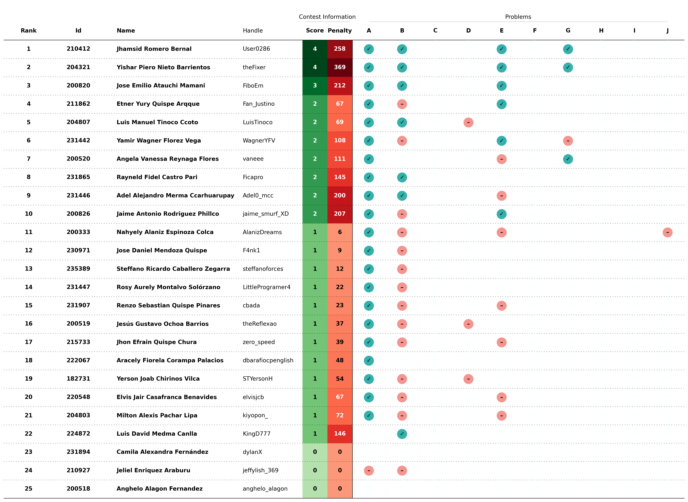
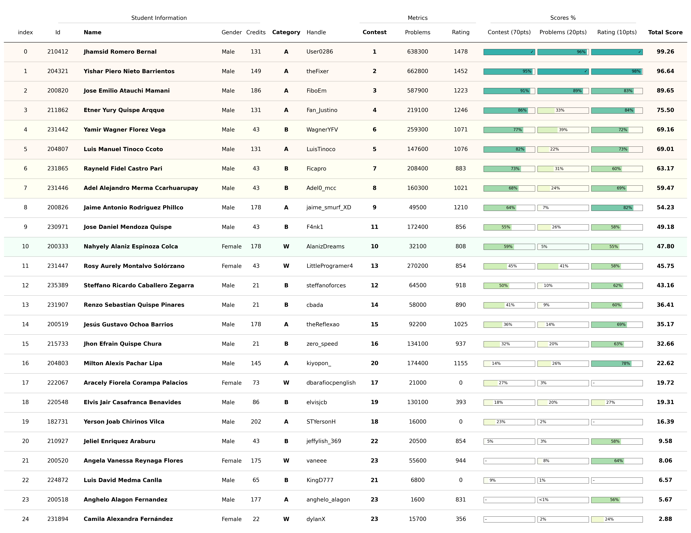

# Training Camp Argentina 2024

Este es un proceso de selección de estudiantes para el [Training Camp Argentina 2024](https://www.pc-arg.com/tc-arg/more_info) que se llevará a cabo en la `Universidad Nacional de Rosario` en la ciudad de `Rosario, Provincia de Santa Fe` del `08 al 19 de julio`.

## Registro

Los estudiantes se registraron para el proceso de selección a través del siguiente:

- **Google Forms**: [REGISTRO PARA EL TRAINIG CAMP ARGENTINA 2024](https://docs.google.com/forms/d/1DBvFgVbH2CUVbbrm9XBCr9KXbFA4eMBG2294ybBhEmk/edit#responses)
  - Correo electrónico
  - Nombre completo
  - Fecha de nacimiento
  - Documento Nacional de Identidad (DNI/Pasaporte)
  - Contacto (Número de teléfono)
  - Código de Universidad
  - Semestre universitario
  - Total de créditos acumulados

Para más detalles sobre los estudiantes registrados, consulte el [archivo de registro](registered.csv).

## Concurso

El concurso de selección se realizó utilizando la plataforma [Virtual Judge](https://vjudge.net/). Este concurso involucra **conceptos algorítmicos básicos** necesarios como requisito mínimo para asistir al `Training Camp Argentina 2024`. Más detalles del concurso a continuación:

- **Concurso**: [Training Camp Selection 2024 - UNSAAC](https://vjudge.net/contest/627547)
- **Contraseña**: `cpunsaac10`
- **Duración**: `2 horas`
- **Participantes**: `25`
- **Problemas**: `10`
  - **A - Two Computers**: `Implementación` ([editorial](https://github.com/lightoj-dev/problem-tutorials/blob/main/1001/en.md))
  - **B - My Nose Grows Now**: `Implementación` ([editorial](https://github.com/lightoj-dev/problem-tutorials/blob/main/1241/en.md))
  - **C - War Of The Ring**: `Estructura de Datos`
  - **D - Largest Rectangle**: `Estructura de Datos`([editorial](https://github.com/lightoj-dev/problem-tutorials/blob/main/1083/en.md))
  - **E - Count Points In Segments**: `Búsqueda Binaria` ([editorial](https://github.com/lightoj-dev/problem-tutorials/blob/main/1088/en.md))
  - **F - Minimum Steps**: `Programación Dinámica`
  - **G - Blossom, Bubbles, and Buttercup**: `Búsqueda en Amplitud` ([editorial](https://github.com/lightoj-dev/problem-tutorials/blob/main/1238/en.md))
  - **H - Reconstruction**: `Árbol de Expansión Mínima` ([editorial](https://github.com/lightoj-dev/problem-tutorials/blob/main/1041/en.md))
  - **I - Great Magical Lamp**: `Árbol de Segmentos`
  - **J - DNA**: `Árbol de Sufijos` ([editorial](https://github.com/lightoj-dev/problem-tutorials/blob/main/1224/en.md))

## Scoreboard

El scoreboard final completo del concurso se puede consultar en el [documento](../../scoreboard/training-camp-argentina-2024/scoreboard.csv) o en la [imagen](../../scoreboard/training-camp-argentina-2024/scoreboard.png).

## Ranking

La información completa del ranking generada por el script para la selección de estudiantes se puede encontrar en el [documento](ranking.csv) o en la [imagen](ranking.png).

## Selección

La lista final de estudiantes seleccionados por categoría se resume en la siguiente tabla:

| Ranking | Código | Nombre | DNI | Fecha de Nacimiento | Contacto | Asistencia |
| - | - | - | - | - | - | - |
| 1 | 210412 | Jhamsid Romero Bernal | 72200023 | 05/11/2003 | +51 914036676 | Sí |
| 2 | 204321 | Yishar Piero Nieto Barrientos | 71645266 | 09/09/2002 | +51 997676613 | Sí |
| 3 | 200820 | Jose Emilio Atauchi Mamani | 74283218 | 26/06/2003 | +51 948331962 | Sí |
| 4 | 211862 | Etner Yury Quispe Arqque | 75386917 | 05/02/2003 | +51 941206887 | Sí |
| 6 | 204807 | Luis Manuel Tinoco Ccoto | 77222876 | 27/02/2003 | +51 967779163 | Sí |

| Ranking | Código | Nombre | DNI | Fecha de Nacimiento | Contacto | Asistencia |
| - | - | - | - | - | - | - |
| 5 | 231442 | Yamir Wagner Florez Vega | 60738622 | 08/05/2006 | +51 915211833 | Sí |
| 7 | 231865 | Rayneld Fidel Castro Pari | 60434260 | 24/07/2006 | +51 920755577 | Sí |
| 8 | 231446 | Adel Alejandro Merma Ccarhuarupay | 76056219 | 17/02/2005 | +51 940347884 | Sí |

| Ranking | Código | Nombre | DNI | Fecha de Nacimiento | Contacto | Asistencia |
| - | - | - | - | - | - | - |
| 10 | 200333 | Nahyely Alaniz Espinoza | 74167832| 23/01/2002 | +51 913200887 | Sí |

## Próximos pasos
- Registrarse para el Training Camp Argentina 2024 a través del [Formulario de Google](https://docs.google.com/forms/d/e/1FAIpQLSdLZTFTqlv4tptvv-tZQtWJkfWPlHRk6thsUQUUmtC8Hm4lDw/viewform)
  - Confirmar asistencia
  - Solicitar carta de invitación

- Contactar a los organizadores para proporcionar información personal adicional