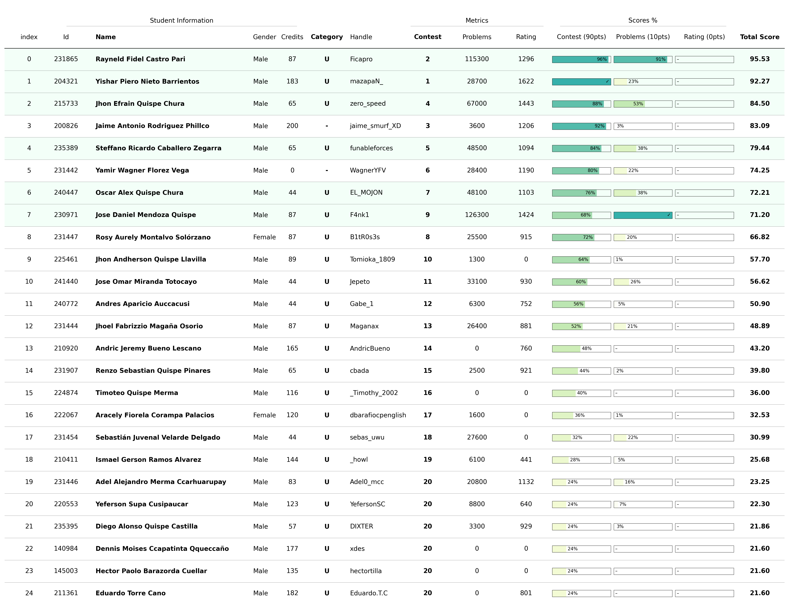

# Training Camp Argentina 2025

Este es un proceso de selección de estudiantes para el [Training Camp Argentina 2025](https://www.pc-arg.com/tc-arg/more_info) que se llevará a cabo en la `Universidad Tecnológica Nacional Santa Fé` en la ciudad de `Santa Fé, Provincia de Santa Fe` del `07 al 18 de Julio`.

## Registro

Los estudiantes se registraron para el proceso de selección a través del siguiente:

- **Google Forms**: [REGISTRO DE SELECCIÓN PARA EL <TRAINIG CAMP ARGENTINA 2025>](https://docs.google.com/forms/d/e/1FAIpQLSfjO8AFxC44gYbyIfCzWGJHNlvvS8MHKU1cf7aQUqjLGXkTog/viewform?usp=dialog)
  - Correo electrónico
  - Código de Universidad
  - Nombre completo
  - Usuario de Codeforces
  - Total de créditos acumulados
  - Semestre universitario

Para más detalles sobre los estudiantes registrados, consulte el [archivo de registro](registered.csv).

## Concurso

El concurso de selección se realizó utilizando la plataforma [Virtual Judge](https://vjudge.net/). Este concurso involucra **conceptos algorítmicos básicos** necesarios como requisito mínimo para asistir al `Training Camp Argentina 2025`. Más detalles del concurso a continuación:

- **Concurso**: [2025 - Selectiva Training Camp Argentina](https://vjudge.net/contest/715074)
- **Contraseña**: `cpunsaac10`
- **Duración**: `3 horas`
- **Participantes**: `25`
- **Problemas**: `10`
  - **[A - Piccoro](https://cses.fi/problemset/task/1641)**
  - **[B - Freezer](https://www.spoj.com/problems/RPLD/en/)**
  - **[C - Goku](https://cses.fi/problemset/task/2402)**
  - **[D - Maestro Roshi](https://cses.fi/problemset/task/3312)**
  - **[E - Bulma](https://cses.fi/problemset/task/1706)**
  - **[F - Cell](https://codeforces.com/problemset/problem/227/A)**
  - **[G - Vegeta](https://codeforces.com/gym/102694/problem/C)**
  - **[H - Krilin](https://codeforces.com/gym/101962/problem/B)**
  - **[I - Gohan](https://cses.fi/problemset/task/1141)**
  - **[J - Majin Boo](https://codeforces.com/problemset/problem/482/A)**

## Scoreboard

El scoreboard final completo del concurso se puede consultar en el [documento](../../scoreboard/training-camp-argentina-2025/scoreboard.csv) o en la [imagen](../../scoreboard/training-camp-argentina-2025/scoreboard.png).

## Ranking

La información completa del ranking generada por el script para la selección de estudiantes se puede encontrar en el [documento](ranking.csv) o en la [imagen](ranking.png).

## Selección

La lista final de estudiantes seleccionados por categoría se resume en la siguiente tabla:

| Ranking | Código | Nombre | DNI | Fecha de Nacimiento | Contacto | Asistencia |
| - | - | - | - | - | - | - |
| 1 | 210412 | Jhamsid Romero Bernal |  |  | | Pendiente |
| 2 | 204321 | Yishar Piero Nieto Barrientos |  |  |  | Pendiente |
| 3 | 200820 | Jose Emilio Atauchi Mamani |  |  |  | Pendiente |
| 4 | 211862 | Etner Yury Quispe Arqque |  |  |  | Pendiente |
| 6 | 204807 | Luis Manuel Tinoco Ccoto |  |  |  | Pendiente |

## Próximos pasos
- Registrarse para el Training Camp Argentina 2025 a través del [Formulario de Google](https://docs.google.com/forms/d/e/1FAIpQLSdLZTFTqlv4tptvv-tZQtWJkfWPlHRk6thsUQUUmtC8Hm4lDw/viewform)
  - Confirmar asistencia
  - Solicitar carta de invitación

- Contactar a los organizadores para proporcionar información personal adicional