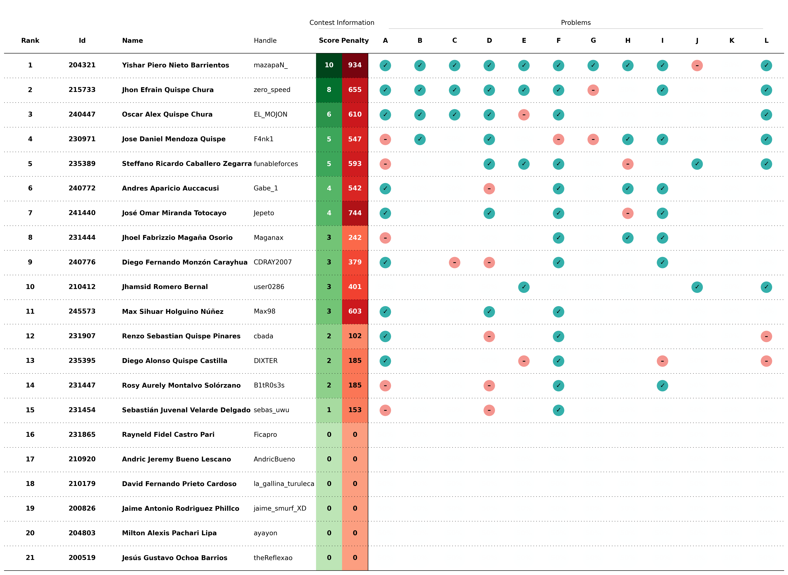
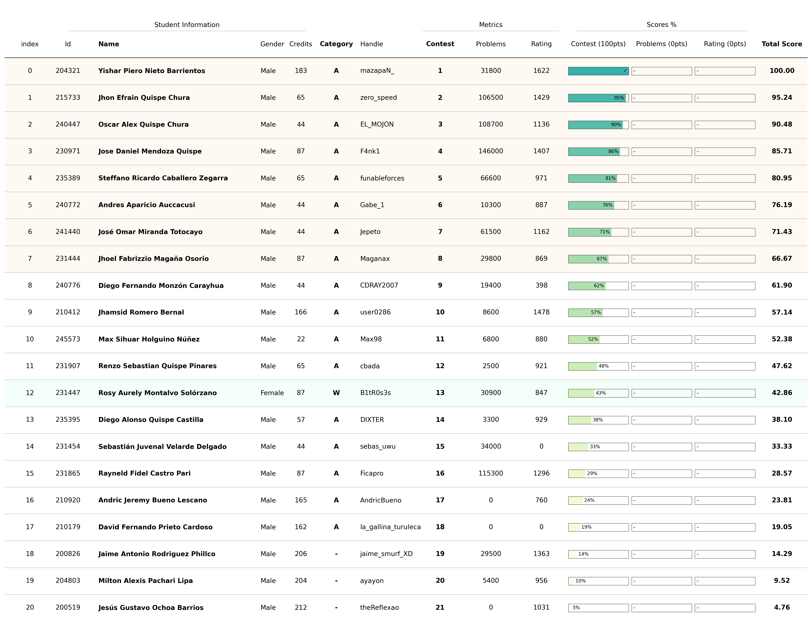

# Training Camp UCSP 2025

Este es un proceso de selección de estudiantes para el [Training Camp UCSP](https://cs.ucsp.edu.pe/cursos/training-camp/) que se llevará a cabo en la `Universidad Católica San Pablo` en la ciudad de `Arequipa, Perú` del `04 al 09 de Agosto`.

## Registro

Los estudiantes se registraron para el proceso de selección a través del siguiente:

- **Google Forms**: [REGISTRO DE SELECCIÓN PARA EL <TRAINIG CAMP UCSP 2025>](https://docs.google.com/forms/d/e/1FAIpQLSedQcb7Df4C2y02l3x0Rj5aw9RWKP2xsvT0-nOMzJh4MYmb6w/viewform?usp=dialog)
  - Correo electrónico
  - Nombre completo
  - Documento de identidad
  - Usuario de Codeforces
  - Usuario de VJudge
  - Código de Universidad
  - Semestre universitario
  - Total de créditos acumulados

Para más detalles sobre los estudiantes registrados, consulte el [archivo de registro](registered.csv).

## Concurso

El concurso de selección se realizó utilizando la plataforma [Virtual Judge](https://vjudge.net/). Este concurso involucra **conceptos algorítmicos básicos** necesarios como requisito mínimo para asistir al `Training Camp UCSP 2025`. Más detalles del concurso a continuación:

- **Concurso**: [2025- Selectiva Training Camp UCSP](https://vjudge.net/contest/725715)
- **Contraseña**: `cpunsaac10`
- **Duración**: `3 horas`
- **Participantes**: `21`
- **Problemas**: `12`
  - **[A - Chopper](https://codeforces.com/problemset/problem/697/A)**
  - **[B - Franky](https://lightoj.com/problem/neighbor-house)**
  - **[C - Sanji](https://codeforces.com/problemset/problem/1795/A)**
  - **[D - Usopp](https://www.spoj.com/problems/PAIRS1/en/)**
  - **[E - Roronoa Zoro](https://codeforces.com/problemset/problem/902/A)**
  - **[F - Shanks](https://codeforces.com/problemset/problem/151/A)**
  - **[G - Nami](https://www.spoj.com/problems/LOSTNSURVIVED/en/)**
  - **[H - Jinbe](https://codeforces.com/problemset/problem/1015/C)**
  - **[I - Gol D. Roger](https://codeforces.com/problemset/problem/1028/A)**
  - **[J - Nico Robin](https://codeforces.com/problemset/problem/514/B)**
  - **[K - Brook](https://codeforces.com/problemset/problem/546/C)**
  - **[L - Monkey D. Luffy](https://www.spoj.com/problems/CDRSANJ/en/)**

## Scoreboard

El scoreboard final completo del concurso se puede consultar en el [documento](../../scoreboard/training-camp-ucsp-2025/scoreboard.csv) o en la [imagen](../../scoreboard/training-camp-ucsp-2025/scoreboard.png).

## Ranking

La información completa del ranking generada por el script para la selección de estudiantes se puede encontrar en el [documento](ranking.csv) o en la [imagen](ranking.png).

## Selección

La lista final de estudiantes seleccionados se resume en la siguiente tabla:

| Ranking | Código | Nombre | DNI | Fecha de Nacimiento | Contacto | Asistencia |
| - | - | - | - | - | - | - |
| 1 | 204321 | Yishar Piero Nieto Barrientos |  |  |  | Si |
| 2 | 215733 | Jhon Efrain Quispe Chura |  |  |  | Si |
| 3 | 240447 | Oscar Alex Quispe Chura |  |  |  | Si |
| 4 | 230971 | Jose Daniel Mendoza Quispe |  |  |  | Si |
| 5 | 235389 | Steffano Ricardo Caballero Zegarra |  |  |  | Si |
| 6 | 240772 | Andres Aparicio Auccacusi Quispe Ynga |  |  |  | Si |
| 7 | 241440 | Jose Omar Miranda Totocayo |  |  |  | Si |
| 8 | 231444 | Jhoel Fabrizzio Magaña Osorio |  |  |  | Si |
| 9 | 231447 | Rosy Aurely Montalvo Solórzano |  |  |  | Si |

Consultar las [Compromiso y Requisitos de Selección](../Ranking.md#compromiso-y-requisitos-de-selección) antes de aceptar la asistencia al evento!

## Próximos pasos
- Registrarse para el Training Camp UCSP 2025 a través del [Formulario de Google](https://docs.google.com/forms/d/e/1FAIpQLSeIQz5APK3y03kDmJpM5sHUmNXWPLVnPlQixIo5u5P-rg5f4Q/closedform)
  - Confirmar asistencia
  - Solicitar carta de invitación

- Contactar a los organizadores para proporcionar información personal adicional
