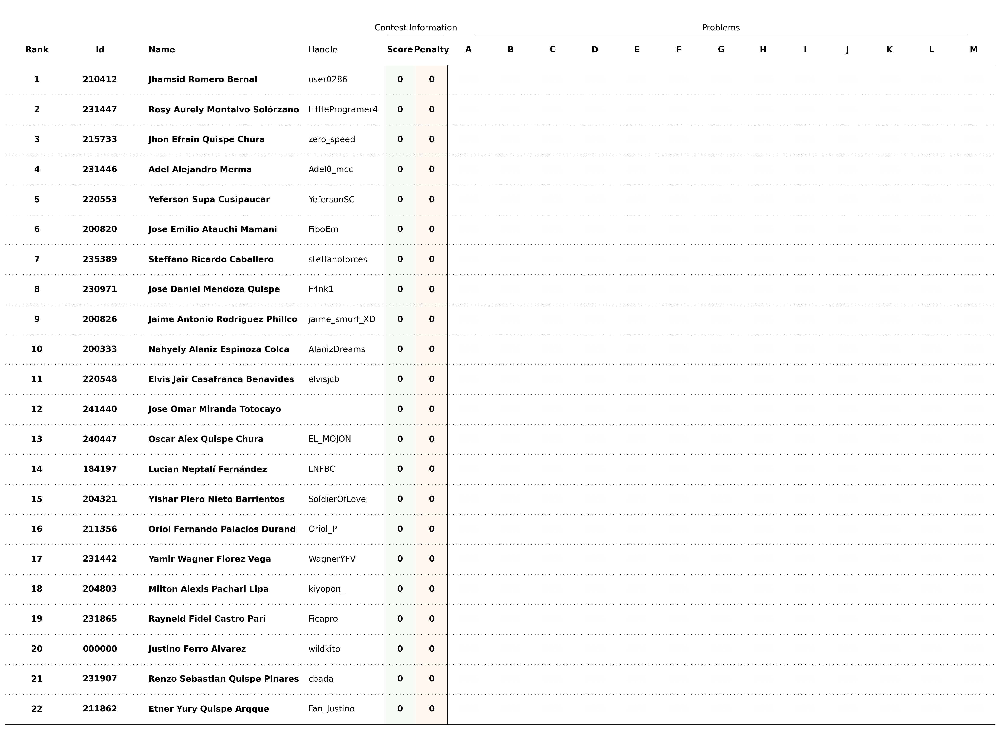

# Selectiva ICPC e IEEExtreme 2024

Este es un proceso interno de selección de estudiantes para el [The 2024 ICPC South America/South Finals](https://icpc.global/regionals/finder/SouthAmerica-South) que se llevará a cabo el `09 de Noviembre`.

## Registro

Los estudiantes se registraron para el proceso de selección a través del siguiente:

- **Google Forms**: [Selectiva ICPC e IEEExtreme 2024](https://docs.google.com/forms/d/1o1al2BORNXih3TMalpBYR0G1Js1k9e4uzKx4ivVKXL0/edit?ts=66e8aa6d#responses)
  - Nombre completo
  - Fecha de nacimiento
  - Código de Universidad
  - Correo electrónico
  - Total de créditos acumulados
  - Lenguage de Programación
  - Usuario de VJudge
  - Usuario de Codeforces
  

Para más detalles sobre los estudiantes registrados, consulte el [archivo de registro](registered.csv).

## Concurso

El concurso de selección se realizó utilizando la plataforma [Virtual Judge](https://vjudge.net/). Este concurso involucra **conceptos algorítmicos básicos** necesarios como requisito mínimo para asistir al `ICPC 2024` y `IEEExtreme 2024`. Más detalles del concurso a continuación:

- **Concurso**: [2024 - UNSAAC Selectiva ICPC](https://vjudge.net/contest/658734)
- **Contraseña**: `*******`
- **Duración**: `5 horas`
- **Participantes**: `22`
- **Problemas**: `13`
  

## Scoreboard

El scoreboard final completo del concurso se puede consultar en el [documento](../../scoreboard/selectiva-icpc-2024/scoreboard.csv) o en la [imagen](../../scoreboard/selectiva-icpc-2024/scoreboard.png).

## Selección

La lista final de estudiantes seleccionados para el **ICPC 2024** se resume en la siguiente tabla:

| Rango | Id | Nombre | Creditos| Fecha de Nacimiento | Contacto | Asistencia |
| - | - | - | - | - | - | - |
| 1 | 0 | a | 0 | 05/11/2003 | +0 | No |

La lista final de estudiantes seleccionados para el **IEEExtreme 2024** se resume en la siguiente tabla:

| Rango | Id | Nombre | Creditos | Fecha de Nacimiento | Contacto | Asistencia |
| - | - | - | - | - | - | - |
| 1 | 0 | a | 0 | 05/11/2003 | +0 | No |

## Próximos pasos

- Contactar a los organizadores para proporcionar información personal adicional
- Entrenar con el grupo seleccionado para los dos concursos oficiales
